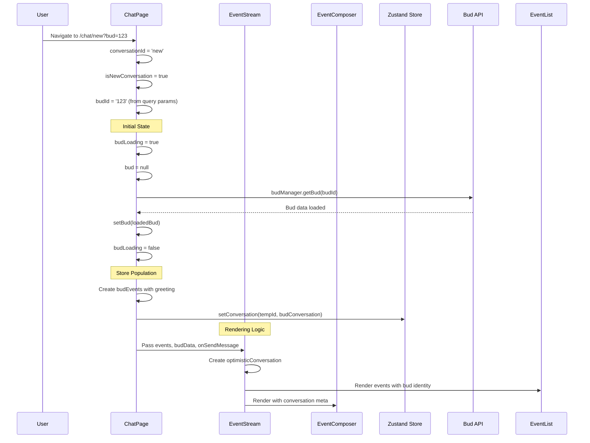

# Chat Component Architecture Specification

This document outlines the architecture and data flow of the chat system, particularly focusing on how new conversations with Buds are handled.

## Component Hierarchy

```
ChatPage (/chat/[conversationId])
├── EventStream
    ├── EventList
    │   └── EventItem (displays messages)
    └── EventComposer (input field)
```

## Data Flow Overview

### New Conversations (`/chat/new?bud=123`)



## State Management

### ChatPage State

| State | Type | Purpose | Timing |
|-------|------|---------|---------|
| `conversationId` | string | 'new' or actual ID | Set immediately from URL |
| `isNewConversation` | boolean | Route logic flag | Derived from conversationId |
| `budId` | string \| null | Bud to load | From query params |
| `bud` | Bud \| null | Loaded bud data | Set after API call |
| `budLoading` | boolean | Loading state | true during bud fetch |
| `tempConversationId` | string | Stable temp ID | Generated once with crypto.randomUUID() |

### Store State (Zustand)

| Store Property | Type | Purpose |
|----------------|------|---------|
| `conversations[tempId]` | Conversation | Persistent conversation data |
| `conversations[tempId].events` | Event[] | All messages/events |
| `conversations[tempId].meta` | ConversationMeta | Identity & config |
| `conversations[tempId].meta.assistant_name` | string | Display name for assistant |

## Component Responsibilities

### ChatPage (`/app/(chat)/chat/[conversationId]/page.tsx`)

**Primary Responsibilities:**
- Route parameter handling (`new` vs real IDs)
- Bud loading and error handling
- Store population with conversation data
- Message sending for new conversations
- URL transitions (temp → real conversation ID)

**Key Logic:**
```typescript
// 1. Determine conversation type
const isNewConversation = conversationId === 'new'

// 2. Generate stable temp ID for new conversations
const tempConversationId = useMemo(() => 
  isNewConversation ? crypto.randomUUID() : conversationId, 
  [isNewConversation, conversationId]
)

// 3. Load bud data if specified
useEffect(() => {
  if (budId) {
    budManager.getBud(budId).then(setBud)
  }
}, [budId])

// 4. Create store conversation with bud data
useEffect(() => {
  if (bud) {
    const events = createBudInitialEvents(bud)
    const conversation = {
      id: tempId,
      events,
      meta: {
        assistant_name: bud.default_json?.name || 'Assistant',
        assistant_avatar: bud.default_json?.avatar || '🤖',
        // ...
      }
    }
    setConversation(tempId, conversation)
  }
}, [bud])
```

### EventStream (`/components/EventStream.tsx`)

**Primary Responsibilities:**
- Unified rendering for new & existing conversations
- Local state management during streaming
- Optimistic UI for bud identity
- Message composition interface

**Key Logic:**
```typescript
// 1. Detect conversation type
const isNewConversation = !conversationId && events !== undefined

// 2. Create optimistic conversation for immediate display
const optimisticConversation = isNewConversation && budData ? {
  meta: {
    assistant_name: budData.default_json?.name || 'Assistant',
    assistant_avatar: budData.default_json?.avatar || '🤖',
    // ...
  }
} : null

// 3. Render with appropriate data source
{events ? (
  // New conversation: use passed events + optimistic identity
  <EventList events={events} conversation={optimisticConversation} />
) : conversationId ? (
  // Existing: use store data
  <EventList conversationId={conversationId} />
) : (
  // Welcome screen
)}
```

### EventComposer (`/components/EventComposer/index.tsx`)

**Primary Responsibilities:**
- Message input handling
- Send button state management
- Conversation context for styling

**Key Logic:**
```typescript
// Uses conversation.meta.assistant_name for any identity-based UI
const assistantName = conversation.meta?.assistant_name || 'Assistant'
```

## Data Flow Phases

### Phase 1: Initial Load
1. User navigates to `/chat/new?bud=123`
2. ChatPage extracts `budId = '123'`
3. `budLoading = true`, `bud = null`
4. EventStream renders with `budData = undefined`

### Phase 2: Bud Loading
1. `budManager.getBud('123')` starts
2. EventStream still has no bud data
3. Uses fallback assistant identity

### Phase 3: Bud Loaded
1. `setBud(loadedBud)` updates state
2. ChatPage creates events with `createBudInitialEvents(bud)`
3. ChatPage creates store conversation with bud identity
4. EventStream receives `budData` prop
5. EventStream creates `optimisticConversation` with bud identity

### Phase 4: Store Ready
1. Store has conversation with proper identity
2. EventStream renders events with bud identity
3. UI shows stable assistant name

## Identity Resolution Priority

The assistant name is resolved in this priority order:

1. **EventList/EventItem**: `conversation?.meta?.assistant_name || 'Assistant'`
2. **EventStream optimistic**: `budData?.default_json?.name || 'Assistant'`
3. **EventStream fallback**: `budData?.default_json?.name || 'Assistant'`
4. **Store conversation**: Set from `bud.default_json?.name || 'Assistant'`

## Current Issue: Assistant Name Flashing

### Problem
Assistant name flashes: `BudName → 'Assistant' → BudName`

### Root Cause Analysis

The flash occurs because there are multiple sources of assistant identity that update at different times:

1. **Phase 1 (Immediate)**: EventStream fallback uses `budData?.default_json?.name || 'Assistant'`
   - But `budData` is initially `undefined`
   - Results in `'Assistant'`

2. **Phase 2 (Bud loads)**: EventStream optimistic uses `budData.default_json?.name`
   - Now `budData` exists
   - Results in correct bud name

3. **Phase 3 (Store updates)**: Store conversation has bud identity
   - Should be consistent with Phase 2

### Timing Issue

The issue is that EventStream renders **before** ChatPage has loaded the bud:

```typescript
// ChatPage - Async bud loading
useEffect(() => {
  if (budId) {
    budManager.getBud(budId).then(setBud)  // ← Async
  }
}, [budId])

// EventStream - Immediate rendering
const optimisticConversation = isNewConversation && budData ? {
  // ← budData is null initially
} : null
```

## Solution Strategies

### Option 1: Prevent Premature Rendering
Don't render EventStream until bud data is available:

```typescript
// In ChatPage
if (isNewConversation && budId && !bud && budLoading) {
  return <LoadingSpinner />
}
```

### Option 2: Consistent Fallback Identity
Use the same fallback everywhere, even when budData is loading:

```typescript
// Store the intended assistant name during loading
const [intendedAssistantName, setIntendedAssistantName] = useState<string>()

useEffect(() => {
  if (budId) {
    // Pre-fetch just the name for immediate display
    setIntendedAssistantName('Loading...')
    budManager.getBud(budId).then(bud => {
      setIntendedAssistantName(bud.default_json?.name || 'Assistant')
      setBud(bud)
    })
  }
}, [budId])
```

### Option 3: Synchronous Bud Identity Loading
Load just the assistant name synchronously from cache/local storage:

```typescript
// Load bud identity immediately, full bud data async
const budIdentity = budManager.getBudIdentity(budId) // Sync from cache
const assistantName = budIdentity?.name || 'Assistant'
```

## Recommended Fix

**Use Option 1**: Prevent rendering until bud loads completely.

This is the cleanest solution because:
- ✅ Eliminates all flashing
- ✅ Ensures consistent state
- ✅ Minimal code changes
- ✅ No complex state synchronization

```typescript
// In ChatPage render logic
if (isNewConversation && budId && budLoading) {
  return <LoadingSpinner />
}

// Only render EventStream when:
// - No bud needed (budId is null)
// - Bud is fully loaded (bud exists)
```

This ensures EventStream always receives complete, consistent data.