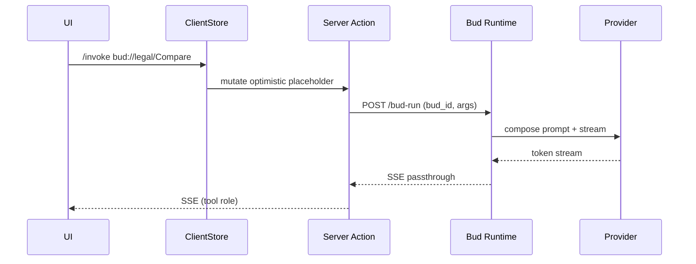

# MCP.md – Model‑Context‑Protocol Integration

> **Purpose:** Turn **Buds** into first‑class MCP servers and surface *all* tools (native + Bud‑wrapped) through a low‑latency **Tool Registry Sidebar** so users can compose agent chains without leaving the chat.

---

## 1  Objectives

1. **Expose Buds as MCP servers** so any conversation can invoke `bud://<workspace>/<budName>` as if it were a remote tool.
2. **Registry Sidebar** lists every MCP‑discoverable server (internal Buds, external URLs, built‑ins) with hover prefetch and drag‑to‑insert convenience.
3. Maintain **one‑round‑trip** mutation budget; don’t add chat‑blocking latency.
4. Keep schema additive—no breaking change to existing DATABASE.md.

---

## 2  Data‑Model Additions

### 2.1  Table: `mcp_servers`

| column         | type        | notes                                              |
| -------------- | ----------- | -------------------------------------------------- |
| `id`           | uuid PK     |                                                    |
| `workspace_id` | uuid        | nullable → public/global                           |
| `bud_id`       | uuid        | nullable; if set ⇒ Bud‑backed                      |
| `endpoint`     | text        | `https://…` or `bud://{bud_id}`                    |
| `metadata`     | jsonb       | MCP Discovery JSON (name, description, methods\[]) |
| `created_at`   | timestamptz |                                                    |

*Insert trigger* keeps `metadata` in sync when a Bud is updated.

### 2.2  Enum bump in `messages.role`

Add `'tool'` (optional) for messages emitted by servers.

---

## 3  MCP Request Flow (Bud‑backed server)



1. **UI** inserts optimistic *tool‑placeholder* message.
2. **Server Action** routes to Bud runtime if `endpoint` begins with `bud://`.
3. Bud runtime spins an LLM stream using the Bud’s stored system prompt & defaults.
4. Stream cascades back to UI exactly like an assistant reply.

Latency ≈ normal chat because BudExec uses the same provider adapter.

---

## 4  Tool Registry Sidebar

| Concern             | Implementation                                                                                                                       |
| ------------------- | ------------------------------------------------------------------------------------------------------------------------------------ |
| **Discovery query** | `SELECT * FROM mcp_servers WHERE workspace_id IN ($userWs, NULL)`; cached 60 s in SWR.                                               |
| **Hover prefetch**  | `GET /api/mcp/meta/:serverId` → returns `metadata.methods[*].signature` for autocomplete.                                            |
| **Insert action**   | Drag method → composer emits `/call <server>.<method>(…)` snippet.                                                                   |
| **UX cues**         | • Bud‑backed tools show Bud avatar.<br>• External tools show domain favicon.<br>• Built‑ins (file‑search, calculator) have icon set. |

Sidebar lives outside chat route; subscribes to `queryClient` cache so switching chats doesn’t re‑render list.

---

## 5  API Surface

### 5.1  POST `/api/mcp/invoke`

```json
{
  "serverId": "uuid",
  "method": "compareClauses",
  "args": { "docA": "…", "docB": "…" },
  "chatId": "uuid"
}
```

Returns SSE stream of `{ role:"tool", id, delta }` messages.

### 5.2  GET `/api/mcp/meta/:serverId`

Returns cached discovery doc for sidebar + autocomplete.

### 5.3  Internal util: `resolveServer(serverId)`

*If* Bud‑backed → load Bud presets; else forward HTTP.

---

## 6  Client‑Side Changes

1. **chatStore** adds `toolMessages` map but otherwise unchanged.
2. **Composer** gains `/` slash‑command palette powered by sidebar cache.
3. **MessageItem** detects `role==='tool'` → renders Tool‑Card component.
4. **Optimistic pattern** identical: insert placeholder, patch on stream.

---

## 7  Security & Rate Limits

| Risk                                    | Mitigation                                                                            |
| --------------------------------------- | ------------------------------------------------------------------------------------- |
| Rogue external tool exfiltrates secrets | Allowlist domains per workspace; Bud‑backed servers run **inside** same RLS boundary. |
| Budget blow‑up via recursive Bud calls  | Depth counter in SA; reject if >3 nested invocations.                                 |
| Abuse / DDOS                            | `mcp_servers.rate_limit` jsonb (tok/sec); middleware token‑bucket enforced.           |

---

## 8  Rollout Plan

1. **Phase α:** Read‑only registry + sidebar UI (no invocation).<br>2. **Phase β:** Enable invocation for Bud‑backed servers only.<br>3. **Phase γ:** External MCP URLs gated by workspace admin toggle.<br>4. Gather latency + error metrics; iterate on prefetch sizing.

---

## 9  Future Evolutions

* **Graph‑based call planner**: Let user chain multiple Bud‑tools visually.
* **Auto‑convert ChatGPT function schemas → MCP meta** for instant wrapping.
* **Local WASM tools**: mark `endpoint` with `wasm://` and execute in WebWorker.

> With these additions, a Bud is no longer “just a preset”—it’s a *self‑contained micro‑agent* available to any chat or external orchestrator via standard MCP calls.  The sidebar turns that ecosystem into a one‑click palette for power‑user workflows.

