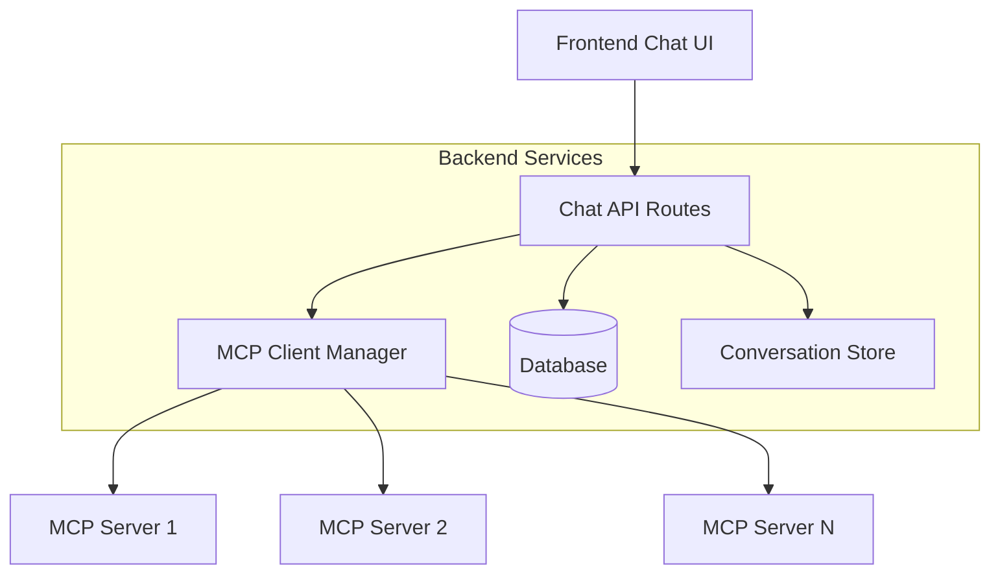

# MCP Client Integration Design

> **Purpose:** Integrate MCP (Model Context Protocol) client functionality into the backend to enable tool calling capabilities for conversations, either inherited from Bud configurations or added as conversation-specific overrides.

---

## 1. Overview

This design enables the chat backend to act as an MCP client, connecting to external MCP servers to provide tool calling capabilities within conversations. This is distinct from the existing MCP.md design which focuses on exposing Buds AS MCP servers.

### Key Objectives

1. **Bud-level MCP configuration**: Buds can be configured with MCP server connections and available tools
2. **Conversation-level overrides**: Conversations can override or extend the MCP configuration from their source Bud
3. **Seamless integration**: Tool calls should integrate naturally with the existing streaming chat architecture
4. **Security and isolation**: Each conversation maintains its own MCP client instance with proper security boundaries

---

## 2. Architecture Overview



### System Flow

1. **Configuration**: Buds/Conversations define MCP server connections and available tools
2. **Initialization**: When a conversation starts, an MCP client manager is initialized with the appropriate configurations
3. **Tool Detection**: Available tools are made available to the LLM through function calling
4. **Tool Execution**: When the LLM requests a tool call, the MCP client executes it through the appropriate server
5. **Response Integration**: Tool results are fed back into the conversation stream

---

## 3. Database Schema Changes

### 3.1 New Tables

#### `mcp_servers`
```sql
CREATE TABLE mcp_servers (
    id UUID PRIMARY KEY DEFAULT gen_random_uuid(),
    workspace_id UUID REFERENCES workspaces(id) ON DELETE CASCADE,
    name TEXT NOT NULL,
    endpoint TEXT NOT NULL, -- URL or transport configuration
    transport_type TEXT NOT NULL DEFAULT 'http', -- 'http', 'stdio', 'websocket'
    auth_config JSONB, -- Authentication configuration
    connection_config JSONB, -- Connection-specific settings
    metadata JSONB, -- Server capabilities, tools, etc.
    is_active BOOLEAN DEFAULT true,
    created_at TIMESTAMPTZ DEFAULT NOW(),
    updated_at TIMESTAMPTZ DEFAULT NOW(),
    
    CONSTRAINT unique_workspace_server_name UNIQUE(workspace_id, name)
);

CREATE INDEX idx_mcp_servers_workspace ON mcp_servers(workspace_id);
CREATE INDEX idx_mcp_servers_active ON mcp_servers(is_active);
```

#### `mcp_tools`
```sql
CREATE TABLE mcp_tools (
    id UUID PRIMARY KEY DEFAULT gen_random_uuid(),
    server_id UUID REFERENCES mcp_servers(id) ON DELETE CASCADE,
    name TEXT NOT NULL,
    description TEXT,
    parameters_schema JSONB, -- JSON Schema for tool parameters
    is_enabled BOOLEAN DEFAULT true,
    created_at TIMESTAMPTZ DEFAULT NOW(),
    
    CONSTRAINT unique_server_tool_name UNIQUE(server_id, name)
);

CREATE INDEX idx_mcp_tools_server ON mcp_tools(server_id);
CREATE INDEX idx_mcp_tools_enabled ON mcp_tools(is_enabled);
```

### 3.2 Existing Table Modifications

#### `buds` table
```sql
-- Add MCP configuration to buds
ALTER TABLE buds ADD COLUMN mcp_config JSONB DEFAULT '{}';

-- Example mcp_config structure:
-- {
--   "servers": ["server-id-1", "server-id-2"],
--   "available_tools": ["server-id-1.tool-name", "server-id-2.other-tool"],
--   "tool_choice": "auto" | "none" | "required" | {"type": "function", "function": {"name": "specific-tool"}}
-- }
```

#### `conversations` table
```sql
-- Add MCP configuration overrides to conversations
ALTER TABLE conversations ADD COLUMN mcp_config_overrides JSONB;

-- Example mcp_config_overrides structure:
-- {
--   "additional_servers": ["server-id-3"],
--   "disabled_tools": ["server-id-1.tool-name"],
--   "tool_choice": "auto"
-- }
```

---

## 4. MCP Client Implementation

### 4.1 Core MCP Client Manager

```typescript
// lib/mcp/mcpClientManager.ts
import { MCPClient } from '@modelcontextprotocol/client'

export interface MCPServerConfig {
  id: string
  name: string
  endpoint: string
  transport_type: 'http' | 'stdio' | 'websocket'
  auth_config?: Record<string, any>
  connection_config?: Record<string, any>
  available_tools?: string[]
}

export interface MCPToolCall {
  tool_name: string
  server_id: string
  parameters: Record<string, any>
}

export interface MCPToolResult {
  tool_name: string
  result: any
  error?: string
}

export class MCPClientManager {
  private clients: Map<string, MCPClient> = new Map()
  private serverConfigs: Map<string, MCPServerConfig> = new Map()
  
  async initialize(serverConfigs: MCPServerConfig[]): Promise<void> {
    // Initialize MCP clients for each configured server
    for (const config of serverConfigs) {
      try {
        const client = await this.createMCPClient(config)
        this.clients.set(config.id, client)
        this.serverConfigs.set(config.id, config)
      } catch (error) {
        console.error(`Failed to initialize MCP client for ${config.name}:`, error)
      }
    }
  }
  
  async getAvailableTools(): Promise<OpenAI.ChatCompletionTool[]> {
    // Convert MCP tools to OpenAI function calling format
    const tools: OpenAI.ChatCompletionTool[] = []
    
    for (const [serverId, client] of this.clients) {
      try {
        const serverTools = await client.listTools()
        for (const tool of serverTools) {
          tools.push({
            type: 'function',
            function: {
              name: `${serverId}.${tool.name}`,
              description: tool.description,
              parameters: tool.inputSchema
            }
          })
        }
      } catch (error) {
        console.error(`Failed to list tools for server ${serverId}:`, error)
      }
    }
    
    return tools
  }
  
  async executeTool(toolCall: MCPToolCall): Promise<MCPToolResult> {
    const client = this.clients.get(toolCall.server_id)
    if (!client) {
      return {
        tool_name: toolCall.tool_name,
        result: null,
        error: `MCP server ${toolCall.server_id} not found`
      }
    }
    
    try {
      const result = await client.callTool(toolCall.tool_name, toolCall.parameters)
      return {
        tool_name: toolCall.tool_name,
        result: result.content
      }
    } catch (error) {
      return {
        tool_name: toolCall.tool_name,
        result: null,
        error: error.message
      }
    }
  }
  
  async cleanup(): Promise<void> {
    // Clean up all MCP client connections
    for (const client of this.clients.values()) {
      await client.close()
    }
    this.clients.clear()
    this.serverConfigs.clear()
  }
  
  private async createMCPClient(config: MCPServerConfig): Promise<MCPClient> {
    // Create MCP client based on transport type
    switch (config.transport_type) {
      case 'http':
        return new MCPClient({
          transport: 'http',
          url: config.endpoint,
          ...config.connection_config
        })
      case 'stdio':
        return new MCPClient({
          transport: 'stdio',
          command: config.endpoint,
          ...config.connection_config
        })
      case 'websocket':
        return new MCPClient({
          transport: 'websocket',
          url: config.endpoint,
          ...config.connection_config
        })
      default:
        throw new Error(`Unsupported transport type: ${config.transport_type}`)
    }
  }
}
```

### 4.2 Configuration Resolution

```typescript
// lib/mcp/mcpConfigResolver.ts
export interface ResolvedMCPConfig {
  servers: MCPServerConfig[]
  available_tools: string[]
  tool_choice: OpenAI.ChatCompletionToolChoiceOption
}

export class MCPConfigResolver {
  constructor(private supabase: SupabaseClient) {}
  
  async resolveConfig(
    conversationId: string,
    workspaceId: string
  ): Promise<ResolvedMCPConfig> {
    // Get conversation with source bud
    const { data: conversation } = await this.supabase
      .from('conversations')
      .select('source_bud_id, mcp_config_overrides')
      .eq('id', conversationId)
      .single()
    
    let budMCPConfig = {}
    
    // Get bud MCP config if exists
    if (conversation?.source_bud_id) {
      const { data: bud } = await this.supabase
        .from('buds')
        .select('mcp_config')
        .eq('id', conversation.source_bud_id)
        .single()
      
      budMCPConfig = bud?.mcp_config || {}
    }
    
    // Merge bud config with conversation overrides
    const mergedConfig = this.mergeConfigs(
      budMCPConfig,
      conversation?.mcp_config_overrides || {}
    )
    
    // Resolve server configurations
    const serverIds = [
      ...(mergedConfig.servers || []),
      ...(mergedConfig.additional_servers || [])
    ]
    
    const { data: servers } = await this.supabase
      .from('mcp_servers')
      .select('*, mcp_tools(*)')
      .in('id', serverIds)
      .eq('workspace_id', workspaceId)
      .eq('is_active', true)
    
    return {
      servers: servers?.map(this.mapServerConfig) || [],
      available_tools: this.resolveAvailableTools(servers, mergedConfig),
      tool_choice: mergedConfig.tool_choice || 'auto'
    }
  }
  
  private mergeConfigs(budConfig: any, overrides: any): any {
    // Merge configuration with overrides taking precedence
    return {
      ...budConfig,
      ...overrides,
      servers: [...(budConfig.servers || []), ...(overrides.additional_servers || [])],
      disabled_tools: [...(budConfig.disabled_tools || []), ...(overrides.disabled_tools || [])]
    }
  }
  
  private mapServerConfig(server: any): MCPServerConfig {
    return {
      id: server.id,
      name: server.name,
      endpoint: server.endpoint,
      transport_type: server.transport_type,
      auth_config: server.auth_config,
      connection_config: server.connection_config,
      available_tools: server.mcp_tools?.map(t => t.name) || []
    }
  }
  
  private resolveAvailableTools(servers: any[], config: any): string[] {
    // Resolve which tools are available based on configuration
    const allTools = servers.flatMap(server => 
      server.mcp_tools?.map(tool => `${server.id}.${tool.name}`) || []
    )
    
    const disabledTools = config.disabled_tools || []
    return allTools.filter(tool => !disabledTools.includes(tool))
  }
}
```

---

## 5. Integration with Chat API

### 5.1 Modified Chat Route

```typescript
// app/api/chat/[conversationId]/route.ts (modifications)
import { MCPClientManager, MCPConfigResolver } from '@/lib/mcp'

export async function POST(request: NextRequest, { params }: { params: Promise<{ conversationId: string }> }) {
  // ... existing auth and validation ...
  
  // Initialize MCP client for this conversation
  const mcpResolver = new MCPConfigResolver(supabase)
  const mcpConfig = await mcpResolver.resolveConfig(conversationId, workspaceId)
  
  const mcpClient = new MCPClientManager()
  await mcpClient.initialize(mcpConfig.servers)
  
  try {
    // Get available tools
    const availableTools = await mcpClient.getAvailableTools()
    
    // Build messages with system context
    const messages = [
      // ... existing system and conversation messages ...
    ]
    
    // Create OpenAI stream with tools
    const stream = await openai.chat.completions.create({
      model,
      messages,
      tools: availableTools,
      tool_choice: mcpConfig.tool_choice,
      stream: true,
    })
    
    // Process stream with tool call handling
    return new Response(
      new ReadableStream({
        async start(controller) {
          const encoder = new TextEncoder()
          
          try {
            for await (const chunk of stream) {
              const delta = chunk.choices[0]?.delta
              
              if (delta?.tool_calls) {
                // Handle tool calls
                for (const toolCall of delta.tool_calls) {
                  if (toolCall.function?.name) {
                    const [serverId, toolName] = toolCall.function.name.split('.')
                    const parameters = JSON.parse(toolCall.function.arguments || '{}')
                    
                    // Execute tool call
                    const result = await mcpClient.executeTool({
                      tool_name: toolName,
                      server_id: serverId,
                      parameters
                    })
                    
                    // Send tool result back to stream
                    const toolMessage = {
                      role: 'tool',
                      tool_call_id: toolCall.id,
                      content: JSON.stringify(result)
                    }
                    
                    controller.enqueue(encoder.encode(
                      `data: ${JSON.stringify({ type: 'tool_result', ...toolMessage })}\n\n`
                    ))
                  }
                }
              } else if (delta?.content) {
                // Handle regular content
                controller.enqueue(encoder.encode(
                  `data: ${JSON.stringify({ type: 'content', content: delta.content })}\n\n`
                ))
              }
            }
          } catch (error) {
            console.error('MCP stream error:', error)
            controller.enqueue(encoder.encode(
              `data: ${JSON.stringify({ type: 'error', error: error.message })}\n\n`
            ))
          } finally {
            await mcpClient.cleanup()
            controller.close()
          }
        }
      }),
      {
        headers: {
          'Content-Type': 'text/plain; charset=utf-8',
          'X-Accel-Buffering': 'no',
          'Cache-Control': 'no-cache',
          'Connection': 'keep-alive',
        }
      }
    )
  } catch (error) {
    await mcpClient.cleanup()
    throw error
  }
}
```

### 5.2 Tool Call Message Storage

```typescript
// lib/mcp/messageHelpers.ts
export interface ToolCallMessage {
  role: 'assistant' | 'tool'
  content?: string
  tool_calls?: Array<{
    id: string
    type: 'function'
    function: {
      name: string
      arguments: string
    }
  }>
  tool_call_id?: string
}

export async function saveToolCallMessage(
  supabase: SupabaseClient,
  conversationId: string,
  message: ToolCallMessage,
  orderKey: string
): Promise<void> {
  const { error } = await supabase
    .from('messages')
    .insert({
      conversation_id: conversationId,
      role: message.role,
      content: message.content || '',
      order_key: orderKey,
      json_meta: {
        tool_calls: message.tool_calls,
        tool_call_id: message.tool_call_id,
        is_tool_call: true
      }
    })
  
  if (error) {
    console.error('Failed to save tool call message:', error)
    throw error
  }
}
```

---

## 6. Frontend Integration

### 6.1 MCP Configuration UI

```typescript
// components/mcp/MCPConfigPanel.tsx
export interface MCPConfigPanelProps {
  budId?: string
  conversationId?: string
  workspaceId: string
  onConfigChange: (config: any) => void
}

export function MCPConfigPanel({ budId, conversationId, workspaceId, onConfigChange }: MCPConfigPanelProps) {
  // UI for configuring MCP servers and tools
  // - Server selection
  // - Tool enablement/disablement
  // - Tool choice configuration
  // - Connection testing
}
```

### 6.2 Tool Call Rendering

```typescript
// components/chat/ToolCallMessage.tsx
export interface ToolCallMessageProps {
  message: Message
  isStreaming?: boolean
}

export function ToolCallMessage({ message, isStreaming }: ToolCallMessageProps) {
  const toolCalls = message.json_meta?.tool_calls || []
  
  return (
    <div className="tool-call-container">
      {toolCalls.map((toolCall) => (
        <div key={toolCall.id} className="tool-call">
          <div className="tool-call-header">
            🔧 {toolCall.function.name}
          </div>
          <div className="tool-call-args">
            {JSON.stringify(JSON.parse(toolCall.function.arguments), null, 2)}
          </div>
          {isStreaming && <div className="tool-call-loading">Executing...</div>}
        </div>
      ))}
    </div>
  )
}
```

---

## 7. API Endpoints

### 7.1 MCP Server Management

```typescript
// app/api/mcp/servers/route.ts
export async function GET(request: NextRequest) {
  // List MCP servers for workspace
}

export async function POST(request: NextRequest) {
  // Create new MCP server configuration
}

// app/api/mcp/servers/[id]/route.ts
export async function GET(request: NextRequest, { params }) {
  // Get specific MCP server configuration
}

export async function PATCH(request: NextRequest, { params }) {
  // Update MCP server configuration
}

export async function DELETE(request: NextRequest, { params }) {
  // Delete MCP server configuration
}
```

### 7.2 Tool Testing

```typescript
// app/api/mcp/servers/[id]/test/route.ts
export async function POST(request: NextRequest, { params }) {
  // Test MCP server connection and list available tools
}

// app/api/mcp/tools/[id]/test/route.ts
export async function POST(request: NextRequest, { params }) {
  // Test specific tool execution
}
```

---

## 8. Security Considerations

### 8.1 Access Control

- **Workspace isolation**: MCP servers are scoped to workspaces
- **User permissions**: Only workspace members can configure/use MCP servers
- **Tool permissions**: Granular control over which tools are available
- **Connection validation**: Validate all MCP server connections before use

### 8.2 Sandboxing

- **Process isolation**: Each MCP client runs in its own context
- **Resource limits**: Timeout and memory limits for tool executions
- **Network policies**: Restrict outbound connections from MCP clients
- **Input validation**: Validate all tool parameters before execution

### 8.3 Audit Logging

```typescript
// lib/mcp/auditLogger.ts
export class MCPAuditLogger {
  async logToolCall(
    workspaceId: string,
    userId: string,
    conversationId: string,
    toolName: string,
    parameters: any,
    result: any,
    error?: string
  ): Promise<void> {
    // Log all tool calls for audit purposes
  }
  
  async logServerConnection(
    workspaceId: string,
    userId: string,
    serverId: string,
    action: 'connect' | 'disconnect' | 'error',
    details?: any
  ): Promise<void> {
    // Log MCP server connection events
  }
}
```

---

## 9. Performance Considerations

### 9.1 Connection Pooling

- **Persistent connections**: Reuse MCP client connections across requests
- **Connection limits**: Limit concurrent connections per server
- **Health monitoring**: Monitor connection health and reconnect as needed

### 9.2 Caching

- **Tool schema caching**: Cache tool schemas to avoid repeated fetches
- **Result caching**: Cache tool results for identical inputs (where appropriate)
- **Configuration caching**: Cache resolved MCP configurations

### 9.3 Async Processing

- **Background initialization**: Initialize MCP clients in background
- **Parallel tool calls**: Execute multiple tool calls concurrently
- **Streaming integration**: Maintain streaming performance during tool execution

---

## 10. Migration Strategy

### 10.1 Phase 1: Infrastructure Setup

1. Create database tables for MCP configuration
2. Implement core MCP client manager
3. Add basic MCP server configuration API
4. Create initial UI for MCP configuration

### 10.2 Phase 2: Chat Integration

1. Integrate MCP client with chat API
2. Implement tool call message handling
3. Add tool call rendering in frontend
4. Test with simple MCP servers

### 10.3 Phase 3: Advanced Features

1. Add tool call result streaming
2. Implement conversation-level overrides
3. Add comprehensive tool testing UI
4. Implement audit logging and monitoring

### 10.4 Phase 4: Production Hardening

1. Add comprehensive error handling
2. Implement security sandboxing
3. Add performance monitoring
4. Comprehensive testing and documentation

---

## 11. Testing Strategy

### 11.1 Unit Tests

- MCP client manager functionality
- Configuration resolution logic
- Tool call execution
- Message handling

### 11.2 Integration Tests

- End-to-end tool calling workflow
- Configuration inheritance from Buds
- Conversation-level overrides
- Error handling scenarios

### 11.3 Performance Tests

- Concurrent tool execution
- Large conversation handling
- Memory usage monitoring
- Connection pooling efficiency

---

## 12. Monitoring and Observability

### 12.1 Metrics

- Tool call success/failure rates
- Tool execution latency
- MCP server connection health
- Resource usage per workspace

### 12.2 Logging

- All tool calls with parameters and results
- MCP server connection events
- Configuration changes
- Error conditions and recovery

### 12.3 Alerting

- MCP server connection failures
- Tool execution timeouts
- High error rates
- Resource exhaustion

---

## 13. Future Enhancements

### 13.1 Advanced Tool Orchestration

- Multi-step tool workflows
- Tool call dependencies
- Conditional tool execution

### 13.2 AI-Powered Tool Selection

- Intelligent tool recommendation
- Context-aware tool filtering
- Usage pattern learning

### 13.3 Workspace-Level Policies

- Tool usage quotas
- Security policies
- Compliance requirements

---

This design provides a comprehensive foundation for integrating MCP client functionality into the existing bud.chat architecture while maintaining performance, security, and the existing user experience.