# OpenAI Responses API Function Calling Integration

**Date**: January 29, 2025  
**Status**: Analysis & Design Phase  
**Priority**: High

## Problem Statement

While we successfully implemented proper type mapping from `ChatCompletionMessageParam` to `ResponseInputItem` for the OpenAI Responses API, **function calls are not being captured correctly**. The server logs show unhandled events for function call arguments, indicating our event transformer is missing critical function calling events.

Additionally, we need to support **multiple tool architectures** in the Responses API:

1. **Local MCP Tools** - Our existing system with local MCP servers
2. **Remote MCP Tools** - OpenAI's remote MCP server integration  
3. **Function Tools** - Traditional function calling (for backwards compatibility)

### Evidence from Server Logs

```javascript
🚨 UNHANDLED OpenAI Responses API event: {
  type: 'response.function_call_arguments.delta',
  allKeys: [ 'type', 'sequence_number', 'item_id', 'output_index', 'delta' ],
  fullEvent: {
    type: 'response.function_call_arguments.delta',
    sequence_number: 34,
    item_id: 'fc_688813fe68e48191be4e2c713e652f9207293fe10e63c538',
    output_index: 1,
    delta: '?"'
  },
  timestamp: 1753748478875,
  note: 'This event type is not being processed by our transformer'
}
```

**Key Missing Events:**
- `response.function_call_arguments.delta` - Streaming function call arguments
- `response.function_call_arguments.done` - Function call arguments complete
- Potentially missing `response.output_item.added` for function calls

## Current Architecture Analysis

### What's Working ✅

1. **Message Type Mapping**: `ChatCompletionMessageParam` → `ResponseInputItem` conversion
2. **Tool Definition**: Proper conversion from `ChatCompletionTool` → Responses API tool format
3. **Basic Event Processing**: Text output and reasoning events are handled
4. **API Request Format**: Using correct `input` array instead of string concatenation

### What's Missing ❌

1. **Function Call Event Handling**: Missing event types in transformer
2. **Tool Call State Management**: No accumulation of streaming function arguments
3. **Tool Call Finalization**: Missing conversion to internal tool call format
4. **MCP Integration**: Function calls aren't being passed to MCP execution system

### Current Event Flow Issues

```mermaid
graph TD
    A[OpenAI Responses API] --> B[Stream Events]
    B --> C[transformOpenAIReasoningEvent]
    C --> D{Event Type?}
    D -->|text/reasoning| E[✅ Handled Correctly]
    D -->|function_call_*| F[❌ UNHANDLED]
    F --> G[🚨 Logged as Unknown]
    E --> H[Event Builder]
    H --> I[Database Storage]
```



## OpenAI Responses API Tool Architectures

The Responses API supports multiple tool types with different event models:

### 1. Function Tools (Traditional)

**Event Types:**
| Event Type | Purpose | Fields |
|-----------|---------|--------|
| `response.output_item.added` | Function call starts | `item_id`, `output_index`, `item` (with `type: "function_call"`) |
| `response.function_call_arguments.delta` | Streaming arguments | `item_id`, `output_index`, `delta` |
| `response.function_call_arguments.done` | Arguments complete | `item_id`, `output_index`, `arguments` (full JSON) |
| `response.output_item.done` | Function call finalized | `item_id`, `output_index`, `item` (complete) |

### 2. Remote MCP Tools (OpenAI-hosted)

**Tool Definition:**
```javascript
{
  type: "mcp",
  server_label: "deepwiki", 
  server_url: "https://mcp.deepwiki.com/mcp",
  require_approval: "never", // or approval configuration
  allowed_tools: ["ask_question"] // optional filtering
}
```

**Event Types:**
| Event Type | Purpose | Fields |
|-----------|---------|--------|
| `response.output_item.added` | MCP call starts | `item` with `type: "mcp_call"` |
| `response.mcp_call_arguments.delta` | Streaming arguments | `item_id`, `delta` |
| `response.mcp_call_arguments.done` | Arguments complete | `item_id`, `arguments` |
| `response.output_item.done` | MCP call finalized | Full `mcp_call` item with `output` |

**Additional Events:**
- `mcp_list_tools` - Tool discovery from remote server
- `mcp_approval_request` - User approval required
- `mcp_approval_response` - User approval/denial

### 3. Local MCP Tools (Our Current System)

Uses function tool format but connects to local MCP servers via our existing `MCPToolExecutor`.

### Function Call Output Structure

**Streaming Deltas:**
```javascript
{
  "type": "response.function_call_arguments.delta",
  "item_id": "fc_12345xyz",
  "output_index": 0,
  "delta": "{\"location\""
}
```

**Final Arguments:**
```javascript
{
  "type": "response.function_call_arguments.done", 
  "item_id": "fc_12345xyz",
  "output_index": 0,
  "arguments": "{\"location\":\"Paris, France\"}"
}
```

## Proposed Solution Architecture

### 1. Hybrid Tool Strategy

We need to support **both local MCP tools and remote MCP tools** to give users maximum flexibility:

**Local MCP Tools (Current System):**
- Use function tool format in Responses API
- Execute via our existing `MCPToolExecutor`
- Full control over MCP server lifecycle
- Lower latency for local tools

**Remote MCP Tools (New):**
- Use OpenAI's native MCP tool format
- Executed by OpenAI infrastructure
- Access to ecosystem of remote MCP servers
- Simplified server management

### 2. Enhanced Event Transformer

**File**: `/lib/providers/openaiResponses.ts`

Add missing event handlers for **both function and MCP tool types**:

```typescript
export function transformOpenAIReasoningEvent(openaiEvent: unknown): StreamEvent | null {
  // ... existing code ...

  switch (event.type) {
    // === FUNCTION CALL EVENTS (Local MCP) ===
    case 'response.output_item.added':
      const item = event.item as { type?: string; id?: string; name?: string };
      if (item?.type === 'function_call') {
        return {
          type: 'tool_start',
          tool_id: item.id as string,
          tool_name: item.name as string
        };
      } else if (item?.type === 'mcp_call') {
        return {
          type: 'mcp_tool_start',
          tool_id: item.id as string,
          tool_name: item.name as string,
          server_label: item.server_label as string
        };
      }
      return null;

    case 'response.function_call_arguments.delta':
      return {
        type: 'tool_arguments_delta',
        tool_id: event.item_id as string,
        output_index: event.output_index as number,
        delta: event.delta as string
      };

    case 'response.function_call_arguments.done':
      return {
        type: 'tool_finalized',
        tool_id: event.item_id as string,
        output_index: event.output_index as number,
        args: JSON.parse(event.arguments as string)
      };

    // === MCP CALL EVENTS (Remote MCP) ===
    case 'response.mcp_call_arguments.delta':
      return {
        type: 'mcp_tool_arguments_delta',
        tool_id: event.item_id as string,
        delta: event.delta as string
      };

    case 'response.mcp_call_arguments.done':
      return {
        type: 'mcp_tool_finalized',
        tool_id: event.item_id as string,
        args: JSON.parse(event.arguments as string)
      };

    case 'response.output_item.done':
      const doneItem = event.item as { type?: string; id?: string; output?: string };
      if (doneItem?.type === 'function_call') {
        return {
          type: 'tool_complete',
          tool_id: doneItem.id as string
        };
      } else if (doneItem?.type === 'mcp_call') {
        return {
          type: 'mcp_tool_complete',
          tool_id: doneItem.id as string,
          output: doneItem.output as string
        };
      }
      return null;

    // === MCP LIFECYCLE EVENTS ===
    case 'response.mcp_list_tools':
      return {
        type: 'mcp_list_tools',
        server_label: event.server_label as string,
        tools: event.tools as unknown[]
      };

    case 'response.mcp_approval_request':
      return {
        type: 'mcp_approval_request',
        approval_request_id: event.id as string,
        tool_name: event.name as string,
        server_label: event.server_label as string,
        arguments: event.arguments as string
      };
  }
}
```

### 2. Function Call State Management

**Challenge**: Responses API streams function arguments in chunks, requiring accumulation.

**Solution**: Enhance ChatEngine to track function call state:

```typescript
// In ChatEngine.ts - handleOpenAIResponsesStream method
const functionCallCollector = new Map<string, {
  item_id: string;
  output_index: number;
  name: string;
  accumulated_args: string;
  is_complete: boolean;
}>();

// Process streaming events
for await (const event of responsesStream) {
  if (event.type === 'tool_start') {
    functionCallCollector.set(event.tool_id, {
      item_id: event.tool_id,
      output_index: event.output_index || 0,
      name: event.tool_name,
      accumulated_args: '',
      is_complete: false
    });
  } 
  
  else if (event.type === 'tool_arguments_delta') {
    const funcCall = functionCallCollector.get(event.tool_id);
    if (funcCall) {
      funcCall.accumulated_args += event.delta;
    }
  }
  
  else if (event.type === 'tool_finalized') {
    const funcCall = functionCallCollector.get(event.tool_id);
    if (funcCall) {
      funcCall.is_complete = true;
      // Add to event builder as tool call segment
      eventBuilder.addToolCall(event.tool_id, funcCall.name, event.args);
    }
  }
}
```

### 3. Integration with Existing MCP System

**Goal**: Make Responses API function calls work with existing MCP tool execution.

**Current MCP Flow**:
```
EventLog → getUnresolvedToolCalls() → MCPToolExecutor → createToolResultEvent
```

**Required Changes**:
1. Ensure function calls from Responses API are added to EventLog correctly
2. Tool call format matches existing MCP expectations
3. Tool results are properly converted back to Responses API input format

### 4. Tool Configuration Strategy 

**Goal**: Support both local and remote MCP tools in bud configuration.

**Enhanced Bud MCP Config**:
```typescript
interface MCPConfig {
  servers: string[];           // Local MCP server IDs
  remote_servers?: RemoteMCPConfig[];  // Remote MCP servers
}

interface RemoteMCPConfig {
  server_label: string;
  server_url: string;
  require_approval: 'never' | 'always' | ApprovalConfig;
  allowed_tools?: string[];
  headers?: Record<string, string>;
}
```

**Tool Generation Strategy**:
```typescript
// In ChatEngine.ts
private async getResponsesAPITools(budId: string, workspaceId: string) {
  const tools = [];
  
  // 1. Get local MCP tools (as function tools)
  const localMCPTools = await this.getOpenAITools(budId, workspaceId);
  tools.push(...localMCPTools);
  
  // 2. Get remote MCP tools (as MCP tools)
  const remoteMCPTools = await this.getRemoteMCPTools(budId);
  tools.push(...remoteMCPTools);
  
  return tools;
}

private async getRemoteMCPTools(budId: string): Promise<MCPTool[]> {
  const { data: bud } = await this.supabase
    .from('buds')
    .select('mcp_config')
    .eq('id', budId)
    .single();
    
  const remoteMCPServers = bud?.mcp_config?.remote_servers || [];
  
  return remoteMCPServers.map(server => ({
    type: 'mcp',
    server_label: server.server_label,
    server_url: server.server_url,
    require_approval: server.require_approval || 'always',
    ...(server.allowed_tools && { allowed_tools: server.allowed_tools }),
    ...(server.headers && { headers: server.headers })
  }));
}
```

### 5. Tool Result Handling

**Challenge**: Different tool result formats for local vs remote MCP.

**Local MCP Tools (Function Format)**:
```javascript
{
  type: 'function_call_output',
  call_id: 'call_123', 
  output: 'result'
}
```

**Remote MCP Tools (Already handled by OpenAI)**:
- Remote MCP results are handled automatically by OpenAI
- No need to return results manually
- Results appear in `mcp_call` output items

**Solution**: Update `convertToResponsesInputItems()` for local tools only:

```typescript
private convertToResponsesInputItems(events: Event[]): OpenAI.Responses.ResponseInputItem[] {
  // ... existing message conversion ...
  
  // Add function call outputs from LOCAL tool result events only
  // (Remote MCP tool results are handled by OpenAI automatically)
  const localToolResults = events
    .filter(e => e.segments.some(s => s.type === 'tool_result'))
    .map(e => e.segments.find(s => s.type === 'tool_result'))
    .filter(Boolean);
    
  for (const toolResult of localToolResults) {
    inputItems.push({
      type: 'function_call_output',
      call_id: toolResult.tool_call_id,
      output: JSON.stringify(toolResult.output)
    });
  }
  
  return inputItems;
}
```

## Implementation Plan

### Phase 1: Function Call Event Handling (Local MCP)
- [ ] Add missing function call event types to `transformOpenAIReasoningEvent`
- [ ] Create new event types for our internal system  
- [ ] Update TypeScript interfaces in `/lib/streaming/frontendEventHandler.ts`
- [ ] Implement function call accumulator in `handleOpenAIResponsesStream`
- [ ] Test local MCP tools with o3-mini model

### Phase 2: Remote MCP Integration  
- [ ] Add MCP event handlers (`mcp_call_*`, `mcp_list_tools`, etc.)
- [ ] Extend bud configuration schema for remote MCP servers
- [ ] Implement `getRemoteMCPTools()` method in ChatEngine
- [ ] Add remote MCP tool configuration UI components
- [ ] Test remote MCP tools (start with DeepWiki)

### Phase 3: Hybrid Tool Architecture
- [ ] Combine local and remote tools in `getResponsesAPITools()`
- [ ] Update tool result handling for mixed tool types
- [ ] Ensure proper event flow for both tool architectures
- [ ] Test conversations using both local and remote tools

### Phase 4: Advanced Features
- [ ] Implement MCP approval flow handling
- [ ] Add tool filtering and configuration options
- [ ] Support authentication headers for remote MCP
- [ ] Add error handling for remote MCP failures

### Phase 5: Testing & Production Readiness
- [ ] Comprehensive testing with various tool combinations
- [ ] Performance benchmarking (local vs remote MCP)
- [ ] Security review for remote MCP integration
- [ ] Documentation and user guides

## Technical Considerations

### Type Safety
- New event types need proper TypeScript definitions
- Function call state needs type-safe interfaces
- Integration points should maintain existing type contracts

### Error Handling
- Malformed function arguments from streaming
- Failed tool executions
- Timeout scenarios for long-running tools

### Performance
- Memory usage for function call accumulators
- Streaming performance with large arguments
- Database storage efficiency for function call data

### Backwards Compatibility
- Existing Chat Completions API must continue working
- Current MCP tool execution shouldn't be affected
- Event storage format should remain consistent

## Success Criteria

1. **Function Calls Captured**: No more unhandled `response.function_call_*` events
2. **MCP Integration**: o3-mini can successfully execute MCP tools
3. **Complete Conversations**: Full round-trip conversations with function calls work
4. **Type Safety**: All TypeScript builds pass without errors
5. **Performance**: No significant performance regression
6. **Testing**: Comprehensive test coverage for new functionality

## Risk Assessment

| Risk | Likelihood | Impact | Mitigation |
|------|------------|--------|------------|
| Breaking existing functionality | Medium | High | Comprehensive testing, feature flags |
| Performance degradation | Low | Medium | Benchmarking, optimization |
| Complex state management bugs | Medium | Medium | Unit tests, integration tests |
| OpenAI API changes | Low | High | Version pinning, monitoring |

## Next Steps

1. **Start with Phase 1**: Implement missing event handlers
2. **Create feature branch**: `feature/responses-api-function-calling`
3. **Incremental testing**: Test each phase thoroughly before proceeding
4. **Documentation**: Update CLAUDE.md with new patterns and gotchas
5. **User testing**: Validate with real MCP tools and o3-mini model

This design addresses the core issue while maintaining system stability and leveraging our existing MCP infrastructure.